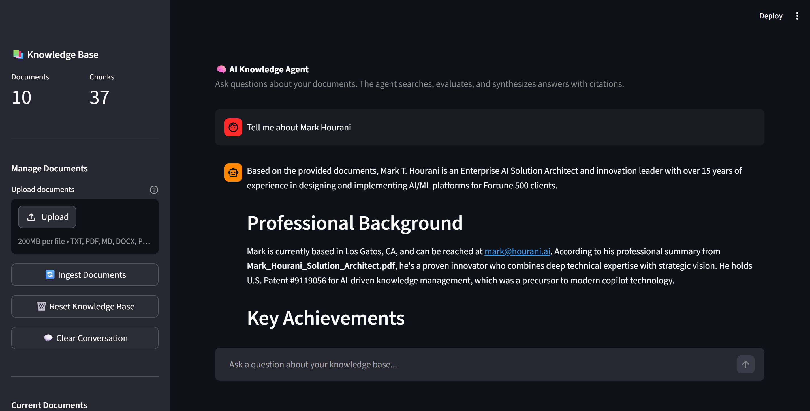

# AI Knowledge Agent

An enterprise-grade agentic RAG (Retrieval-Augmented Generation) system powered by LangGraph, ChromaDB, and Anthropic's Claude.

## What It Does

Unlike simple RAG implementations that blindly retrieve and respond, this agent **reasons** about your questions:

1. **Analyzes** your question and optimizes the search query
2. **Searches** a vector knowledge base using semantic similarity
3. **Evaluates** whether the results are sufficient to answer
4. **Refines** its search strategy if needed (up to 2 iterations)
5. **Generates** a cited answer grounded in your documents

The agent maintains **conversation memory**, enabling natural multi-turn interactions with follow-up questions.

## Screenshot



## Architecture
```
User Question
      │
      ▼
┌─────────────┐
│   Analyze    │ ← Optimizes query using conversation history
│   Question   │
└──────┬──────┘
       ▼
┌─────────────┐
│   Search     │ ← Semantic search via ChromaDB
│   Knowledge  │
│   Base       │
└──────┬──────┘
       ▼
┌─────────────┐     ┌──────────┐
│  Evaluate    │────▶│  Refine  │ ← Try different search angle
│  Results     │ No  │  Search  │
└──────┬──────┘     └─────┬────┘
       │ Yes              │
       ▼                  │
┌─────────────┐           │
│  Generate    │◀──────────┘
│  Answer      │
└─────────────┘
```

## Tech Stack

- **LangGraph** — Agentic workflow orchestration with state management
- **ChromaDB** — Local vector database with built-in embeddings
- **Anthropic Claude** — LLM for reasoning and answer generation
- **LangChain** — Foundation framework for LLM application building

## Quick Start

### Prerequisites

- Python 3.10+
- Anthropic API key ([get one here](https://console.anthropic.com))

### Installation
```bash
git clone https://github.com/mhourani/ai-knowledge-agent.git
cd ai-knowledge-agent
python3 -m venv venv
source venv/bin/activate
pip install -r requirements.txt
```

### Configuration
```bash
cp .env.example .env
# Edit .env and add your Anthropic API key
```

### Usage

**1. Add documents to the `docs/` folder** (supports .txt, .pdf, .md)

**2. Ingest documents into the knowledge base:**
```bash
python3 main.py ingest
```

**3. Start asking questions:**
```bash
python3 main.py ask
```

**4. Reset the knowledge base:**
```bash
python3 main.py reset
```

### Example Session
```
You: What are the key dimensions of AI readiness?
Agent: Based on the knowledge base, there are five key dimensions...

You: Tell me more about the first one
Agent: Data maturity, the first dimension, refers to...

You: How does that relate to building POCs?
Agent: The connection between data maturity and POC success is...
```

## Project Structure
```
ai-knowledge-agent/
├── main.py               # CLI entry point
├── src/
│   ├── agent.py          # LangGraph agent with reasoning loop
│   ├── vectorstore.py    # ChromaDB vector store management
│   ├── loader.py         # Document loading and chunking
│   └── config.py         # Configuration settings
├── tests/
├── docs/                 # Place your documents here
├── requirements.txt
└── .env.example
```

## Roadmap

- [ ] Conversation memory ✅
- [ ] Word, PowerPoint, and Excel document support
- [ ] Image/multimodal document support
- [ ] OneDrive integration via Microsoft Graph API
- [ ] Streamlit web UI
- [ ] Comprehensive test suite with CI/CD
- [ ] Docker containerization

## Author

**Mark Hourani** — Enterprise AI Solution Architect
- Patent holder: U.S. Patent #9119056 (AI-driven knowledge management)
- [hourani.ai](https://hourani.ai)
- [LinkedIn](https://www.linkedin.com/in/markhourani)

## License

MIT
```